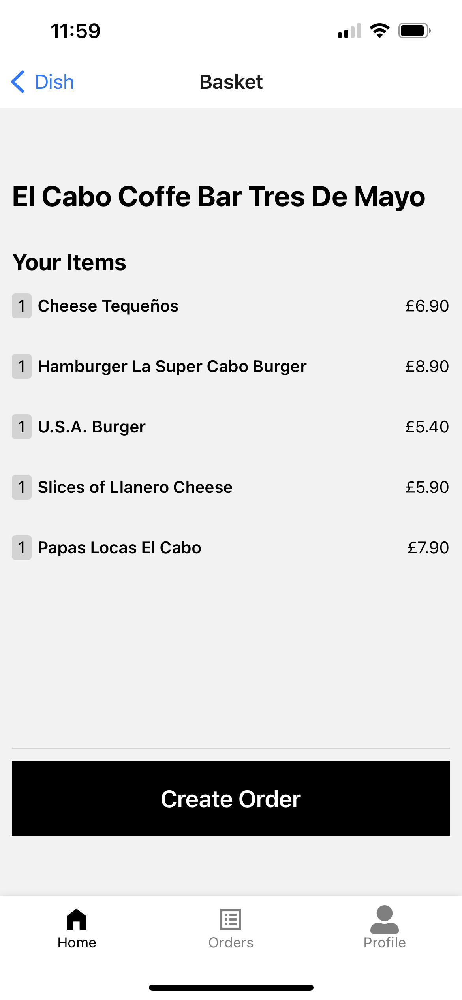

<h1>Uber Eats Clone - React Native</h1>

<h2> Table of Contents </h2>

- [About the Project](#about-the-project)
  - [Key Features](#key-features)
- [Getting Started](#getting-started)
  - [Installation](#installation)
  - [Launch the app](#launch-the-app)
- [Contact](#contact)
- [Screenshots](#screenshots)

## About the Project

This is a WIP full stack mobile app built with the following technologies:

- React Native
- Expo
- AWS Amplify

### Key Features

- User authentication and sessions
- Dynamically generated components

## Getting Started

### Installation

```javascript
git clone git@github.com:glowingmanagement/uber-clone-full-stack.git
cd uber-clone-full-stack
cd UberEatsUser
npm install
```

### Launch the app

```javascript

npm start

```

## Contact

If you have any questions, contact me at: josh@glowingmanagement.com

- View my Github [here](https://www.github.com/glowingmanagement)
- View my LinkedIn [here](https://www.linkedin.com/in/joshholmes22)
- View my Portfolio [here](https://glowingmanagement.github.io/my-portfolio/)

## Screenshots


